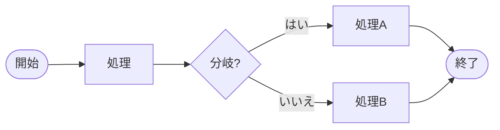
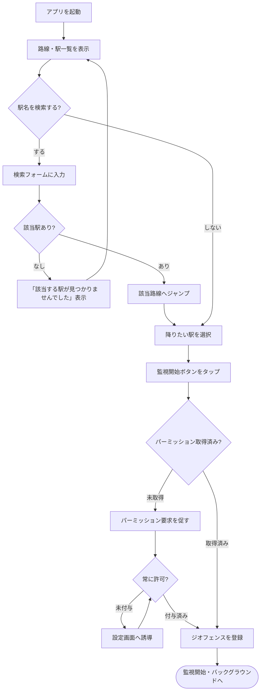
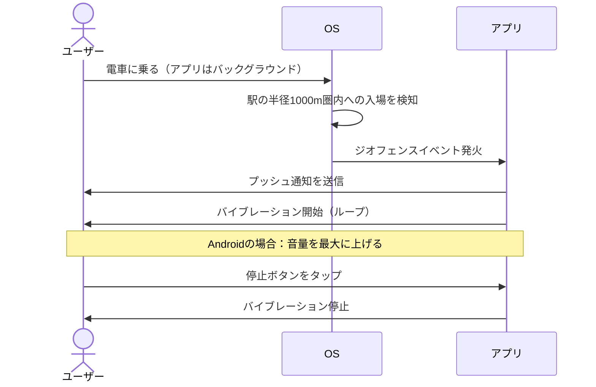
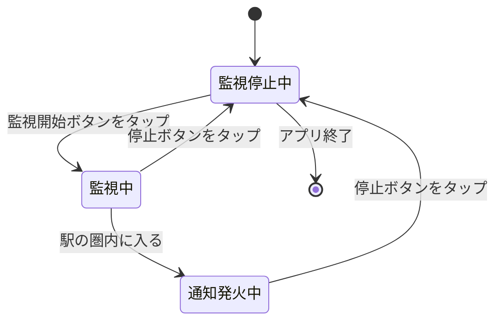

# マーメイド記法 学習メモ

> requirements.md の業務フロー（ユースケース）を題材にしたマーメイド記法のサンプル集。

---

## マーメイド記法とは

マークダウンファイル（`.md`）の中に、**テキストだけで図を書ける記法**。
コードブロックに `mermaid` と指定することで、対応ツールが自動的に図として描画してくれる。

````markdown
```mermaid
ここに図の記述を書く
```
````

---

## 基本の構造

どの図も **「図の種類の宣言」から始まる** というルールは共通。

```
flowchart TD        ← ① 図の種類を最初の行に書く
    A --> B         ← ② 以降にノード（要素）と矢印を書いていく
    B --> C
```

`flowchart TD` の `TD` は方向（Direction）を指定している。

| 指定 | 意味 | 図の向き |
|---|---|---|
| `TD` | Top to Down | 上から下 |
| `LR` | Left to Right | 左から右 |
| `BT` | Bottom to Top | 下から上 |
| `RL` | Right to Left | 右から左 |

---

## ノード（要素）の形

フローチャートでは、テキストを囲む記号によってノードの形が変わる。

| 記法 | 形 | 用途 |
|---|---|---|
| `A[テキスト]` | 四角 | 処理・手順 |
| `A{テキスト}` | ひし形 | 分岐・条件 |
| `A([テキスト])` | 角丸 | 開始・終了 |
| `A((テキスト))` | 円 | 接続点 |
| `A>テキスト]` | 非対称 | 注釈 |



---

## 矢印（接続）の種類

| 記法 | 見た目 | 用途 |
|---|---|---|
| `A --> B` | 実線矢印 | 通常の流れ |
| `A -- テキスト --> B` | ラベル付き実線矢印 | 条件を示す流れ |
| `A --- B` | 矢印なし実線 | 関連（方向なし） |
| `A -.-> B` | 点線矢印 | 補足的な流れ |
| `A ==> B` | 太線矢印 | 強調 |

---

## 利用できる図の種類

マーメイドには複数の図の種類がある。

| 図の種類 | 宣言キーワード | 用途 |
|---|---|---|
| フローチャート | `flowchart TD` | 処理の手順・分岐 |
| シーケンス図 | `sequenceDiagram` | 登場人物間のやりとり |
| 状態遷移図 | `stateDiagram-v2` | 状態の変化 |
| クラス図 | `classDiagram` | クラスの構造・関係 |
| ER図 | `erDiagram` | データベースの設計 |
| ガントチャート | `gantt` | スケジュール管理 |
| 円グラフ | `pie` | 割合の可視化 |

このファイルでは、このアプリの業務フローに合わせて **フローチャート・シーケンス図・状態遷移図** の3種類を紹介する。

---

## VSCode でのプレビュー方法

1. 拡張機能「**Markdown Preview Mermaid Support**」をインストール
   - 拡張機能パネルで `bierner.markdown-mermaid` を検索
2. このファイルを開いて `Cmd + Shift + V`（または右上のプレビューボタン）

---

## 図の種類と向いている用途

| 図の種類 | 記法 | 向いている内容 |
|---|---|---|
| フローチャート | `flowchart TD` | UC-01のような「操作手順・分岐」 |
| シーケンス図 | `sequenceDiagram` | UC-02のような「登場人物間のやりとり」 |
| 状態遷移図 | `stateDiagram-v2` | 監視ON/OFFのような「状態の変化」 |

---

## 1. フローチャート — UC-01「降りる駅を設定してアラームを開始する」



### 記法のポイント

| 記法 | 形 | 意味 |
|---|---|---|
| `[テキスト]` | 四角 | 処理 |
| `{テキスト}` | ひし形 | 分岐・条件 |
| `([テキスト])` | 角丸 | 開始・終了 |
| `-- テキスト -->` | 矢印 | 条件付きの流れ |
| `-->` | 矢印 | 無条件の流れ |
| `TD` | — | Top to Down（上から下）の向き |

### コード全文

```
flowchart TD
    A[アプリを起動] --> B[路線・駅一覧を表示]
    B --> C{駅名を検索する?}
    C -- する --> D[検索フォームに入力]
    D --> E{該当駅あり?}
    E -- なし --> F["「該当する駅が見つかりませんでした」表示"]
    F --> B
    E -- あり --> G[該当路線へジャンプ]
    G --> H[降りたい駅を選択]
    C -- しない --> H
    H --> I[監視開始ボタンをタップ]
    I --> J{パーミッション取得済み?}
    J -- 未取得 --> K[パーミッション要求を促す]
    K --> L{常に許可?}
    L -- 未付与 --> M[設定画面へ誘導]
    M --> L
    L -- 付与済み --> N
    J -- 取得済み --> N[ジオフェンスを登録]
    N --> O([監視開始・バックグラウンドへ])
```

---

## 2. シーケンス図 — UC-02「駅に近づいて降車通知を受け取る」



### 記法のポイント

| 記法 | 意味 |
|---|---|
| `actor 名前` | 人のアイコンとして表示される登場人物 |
| `participant 名前` | ボックスとして表示される登場人物 |
| `->>` | 実線矢印（通常のメッセージ） |
| `-->>` | 破線矢印（応答・返り値） |
| `Note over A,B: テキスト` | 補足メモ（A〜Bの間に表示） |

### コード全文

```
sequenceDiagram
    actor ユーザー
    participant OS
    participant アプリ

    ユーザー->>OS: 電車に乗る（アプリはバックグラウンド）
    OS->>OS: 駅の半径1000m圏内への入場を検知
    OS->>アプリ: ジオフェンスイベント発火
    アプリ->>ユーザー: プッシュ通知を送信
    アプリ->>ユーザー: バイブレーション開始（ループ）
    Note over アプリ,ユーザー: Androidの場合：音量を最大に上げる
    ユーザー->>アプリ: 停止ボタンをタップ
    アプリ->>ユーザー: バイブレーション停止
```

---

## 3. 状態遷移図 — 監視状態の遷移（UC-01〜UC-03）



### 記法のポイント

| 記法 | 意味 |
|---|---|
| `[*]` | 開始状態・終了状態 |
| `状態A --> 状態B: テキスト` | 状態の遷移とそのトリガー |
| `stateDiagram-v2` | v2を使うと見た目が綺麗になる |

### コード全文

```
stateDiagram-v2
    [*] --> 監視停止中

    監視停止中 --> 監視中: 監視開始ボタンをタップ
    監視中 --> 通知発火中: 駅の圏内に入る
    通知発火中 --> 監視停止中: 停止ボタンをタップ
    監視中 --> 監視停止中: 停止ボタンをタップ

    監視停止中 --> [*]: アプリ終了
```
